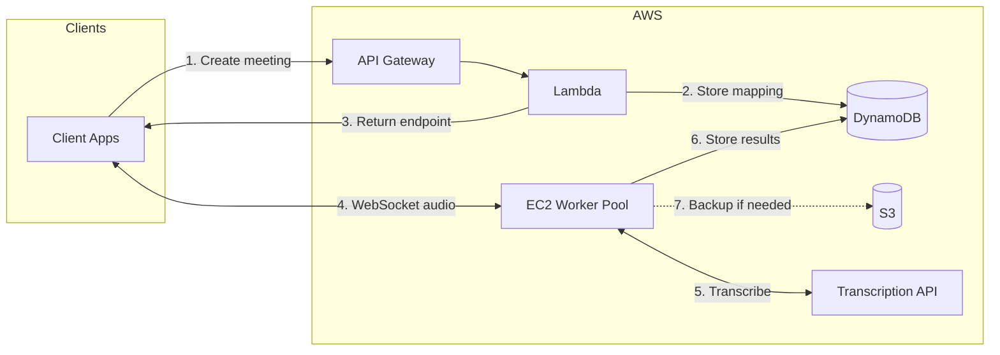
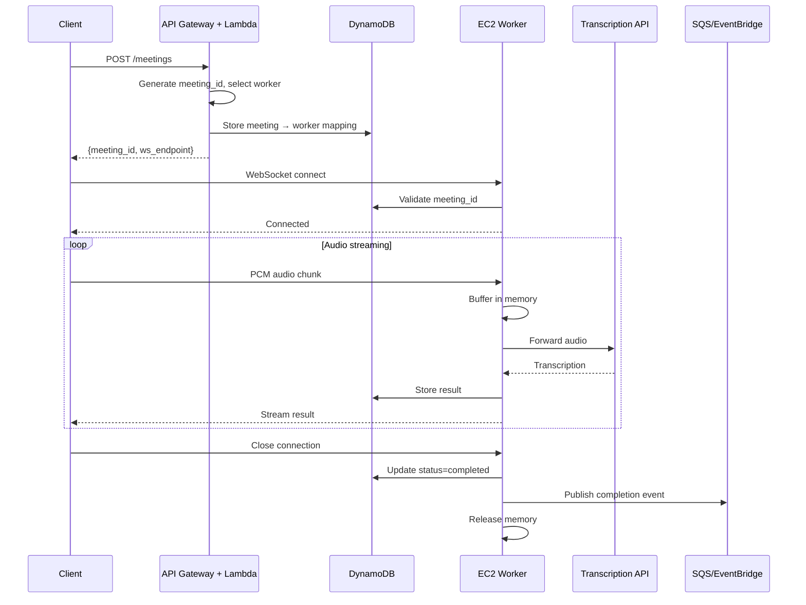

# Durable Objects to AWS Migration: POC Architecture

**Status:** Draft  
**Date:** 2025-02-04  
**Depends on:** 00-preface.md  

---

## 1. POC Scope

Build a minimal system that demonstrates:

1. API creates meeting session, returns WebSocket endpoint
2. Client streams audio to worker via WebSocket
3. Worker buffers audio, forwards to transcription API
4. Worker streams results back to client and stores in database
5. Session cleanup on meeting end

### Excluded from POC

- Load balancer (direct IP routing)
- WebRTC/SFU (WebSocket sufficient)
- Multi-region
- Worker failure recovery (client fallback upload)
- JWT authentication (stub/skip)

---

## 2. Architecture



---

## 3. Components

### 3.1 API Layer: API Gateway + Lambda

**Purpose:** Meeting creation, session routing.

| Responsibility | Detail |
|----------------|--------|
| Generate meeting_id | UUID |
| Select worker | Round-robin from healthy pool |
| Store mapping | meeting_id → worker in DynamoDB |
| Return endpoint | Direct WebSocket URL to worker |

Lambda is appropriate here because meeting creation is infrequent and stateless. Cold starts (100-500ms) are acceptable for API calls, not in the audio path.

### 3.2 Worker Pool: EC2 + Auto Scaling Group

**Purpose:** Receive audio, buffer, transcribe, stream results.

| Aspect | Configuration |
|--------|---------------|
| Instance type | t3.medium (4GB RAM) or t3.large (8GB) |
| Sessions per instance | ~25-60 (at 128MB each) |
| Min capacity | 1 (scale to minimal when idle) |
| Max capacity | Unlimited (autoscale) |
| Scaling metric | Custom: ActiveSessions per instance |
| Health check | HTTP endpoint on worker |

**Why EC2 over alternatives:**

| Option | Cold Start | Why Not for POC |
|--------|-----------|-----------------|
| Lambda | 100-500ms | 15-min limit, no persistent WebSocket |
| Fargate | 30-60s | Exceeds 1s requirement |
| EKS | ~0 (pre-warmed) | Overkill complexity |
| **EC2 + ASG** | ~0 (pre-warmed) | Simple, meets requirements |

**Memory isolation:** Single process with async task isolation. Application code enforces 128MB soft limit per session. Offload to S3 if exceeded.

### 3.3 State Store: DynamoDB

**Purpose:** Meeting metadata, transcription results.

| Table | Key | Attributes |
|-------|-----|------------|
| meetings | PK: meeting_id | worker_endpoint, status, created_at, ttl |
| transcriptions | PK: meeting_id, SK: chunk_id | text, timestamp_start, timestamp_end |

**Why DynamoDB:**
- Pay-per-request (cheap at low volume)
- Sub-10ms latency
- Key-value pattern fits use case
- TTL for automatic cleanup

RDS is viable but overkill for this key-value workload.

### 3.4 Audio Backup: S3

**Purpose:** Overflow storage, client fallback uploads.

| Trigger | Action |
|---------|--------|
| Session memory > 100MB | Offload oldest chunks to S3 |
| Client fallback | Upload full audio file |
| Transcription complete | Delete chunks (configurable retention) |

**Retention policy:** Configurable. Default 7 days for debugging; reduce to immediate deletion in production if not needed.

**Bucket structure:**
```
s3://audio-bucket/meetings/{meeting_id}/chunks/
s3://audio-bucket/meetings/{meeting_id}/full-upload.pcm
```

### 3.5 Connection Routing: Direct IP (No Load Balancer)

**For POC:**
1. Lambda selects worker, stores in DynamoDB
2. Lambda returns worker's public DNS directly
3. Client connects to worker WebSocket endpoint
4. No load balancer in audio path

**Why no ALB/NLB for POC:**
- ALB: HTTP/WebSocket only; adds latency; sticky sessions via cookies add complexity
- NLB: TCP/UDP passthrough; useful for WebRTC (UDP), overkill for WebSocket (TCP)
- Direct IP: Simplest, no added latency, sufficient for POC

Load balancer becomes relevant in production for health checks, TLS termination, and connection draining during deployments.

---

## 4. Request Flow



---

## 5. Scaling

### Autoscaling Configuration

| Parameter | Value |
|-----------|-------|
| Metric | Custom: ActiveSessionsPerInstance |
| Scale out | When average > 70% capacity |
| Scale in | When average < 30% capacity |
| Cooldown | 300 seconds |
| Min instances | 1 |
| Max instances | No limit |

**Scale to minimal:** When no active meetings, ASG scales to 1 instance. Instance remains warm for fast session start.

**Worker publishes metric:** Each worker reports ActiveSessions to CloudWatch every 60 seconds.

### Hibernation Behavior

| Condition | Behavior |
|-----------|----------|
| No active meetings | Scale to min (1 instance) |
| Meeting starts | Existing instance handles it (~0 latency) |
| Capacity exceeded | ASG launches new instance (30-60s for new EC2, but existing instance handles load) |

---

## 6. Garbage Collection

### Session Cleanup

| Event | Action |
|-------|--------|
| Audio chunk transcribed | Remove from memory buffer |
| Memory > 100MB | Offload to S3 |
| Transcription error | Retry (configurable: default 3x, adjustable strategy) |
| Retries exhausted | Mark failed, release memory |

### Post-Session Cleanup

| Event | Action |
|-------|--------|
| Client disconnects | 5-minute grace period |
| Grace period expires | Finalize transcription |
| Transcription complete | Release memory |
| S3 chunks exist | Delete per retention policy |
| Completion | Publish event to SQS/EventBridge |
| DynamoDB TTL | Auto-delete after 24h (configurable) |

---

## 7. Observability

### CloudWatch (Native)

| Metric | Source |
|--------|--------|
| ActiveSessions | Worker custom metric |
| MemoryUsage | Worker custom metric |
| TranscriptionLatency | Worker custom metric |
| API Latency | API Gateway |
| Lambda Duration | Lambda |
| DynamoDB Latency | DynamoDB |

### Grafana Export (Optional)

For richer dashboards, export metrics via:
- CloudWatch metric streams to Grafana Cloud
- Application code direct to Prometheus/Grafana (lower latency)

CloudWatch is fully AWS-native and sufficient for POC. Grafana recommended for production if team prefers unified observability.

---

## 8. Cost Estimate (POC)

| Component | Configuration | Monthly Cost |
|-----------|---------------|--------------|
| API Gateway | ~10K requests | ~$0.04 |
| Lambda | ~10K invocations | ~$0.20 |
| EC2 (1x t3.medium) | On-demand, scaled down | ~$30 |
| DynamoDB | On-demand, <1GB | ~$1 |
| S3 | <10GB | ~$0.25 |
| CloudWatch | Basic metrics | ~$0 |
| **Total** | | **~$35/month** |

---

## 9. Deliverables

| Item | Description |
|------|-------------|
| Terraform | VPC, EC2, ASG, DynamoDB, S3, Lambda, API Gateway |
| Worker | WebSocket server (Node.js or Python) |
| Client | Web Audio API capture + WebSocket streaming |
| README | Deployment instructions |

---

## 10. References

- [AWS Auto Scaling Groups](https://docs.aws.amazon.com/autoscaling/ec2/userguide/auto-scaling-groups.html)
- [CloudWatch Custom Metrics](https://docs.aws.amazon.com/AmazonCloudWatch/latest/monitoring/publishingMetrics.html)
- [DynamoDB TTL](https://docs.aws.amazon.com/amazondynamodb/latest/developerguide/TTL.html)
- [API Gateway REST APIs](https://docs.aws.amazon.com/apigateway/latest/developerguide/apigateway-rest-api.html)
