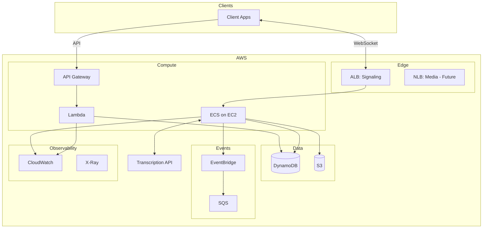
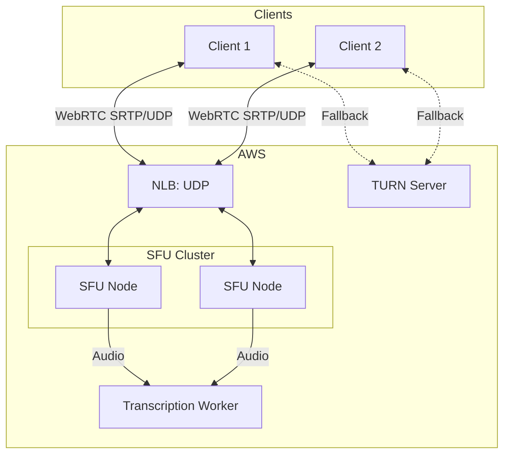
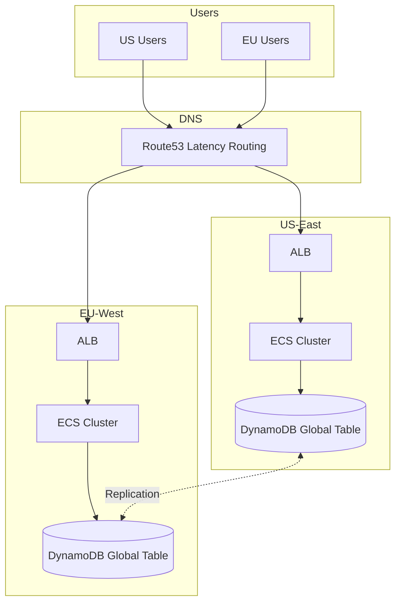

# Durable Objects to AWS Migration: Production Architecture

**Status:** Draft  
**Date:** 2025-02-04  
**Depends on:** 00-preface.md, 01-poc-architecture.md  

---

## 1. Production Scope

This document extends the POC architecture with:

- Load balancer for resilience and deployment flexibility
- WebRTC/SFU for sub-100ms latency (when required)
- Worker failure recovery
- Multi-region (future)
- Full options analysis for each component

---

## 2. Component Options

### 2.1 Worker Pool

| Option | Cold Start | Memory Isolation | Scaling | Complexity | Recommendation |
|--------|-----------|------------------|---------|------------|----------------|
| **EC2 + ASG** | ~0 (pre-warmed) | Process | ASG rules | Low | POC |
| **ECS on EC2** | ~0 (pre-warmed) | Container | Service | Medium | Production |
| **ECS Fargate** | 30-60s | Container | Service | Medium | No (too slow) |
| **EKS** | ~0 (pre-warmed) | Pod | HPA/KEDA | High | Large scale only |
| **Lambda** | 100-500ms | Function | Automatic | Low | No (15-min limit) |

**Production recommendation:** ECS on EC2 with capacity providers.

- Container isolation per meeting or per N meetings
- Easier deployment than raw EC2 (docker push + service update)
- EC2 capacity provider ensures fast starts (pre-warmed instances)
- Service auto-scaling based on custom metrics

### 2.2 State Store

| Option | Latency | Consistency | Query Flexibility | Cost | Recommendation |
|--------|---------|-------------|-------------------|------|----------------|
| **DynamoDB** | <10ms | Strong (optional) | Key-value + GSI | Pay per request | Best fit |
| **ElastiCache Redis** | <1ms | Strong | Key-value | Always-on ($12+/mo min) | If sub-ms needed |
| **RDS Postgres** | 5-20ms | Strong | Full SQL | $15+/mo min | If complex queries needed |

**Recommendation:** DynamoDB for both POC and production.

RDS is viable if:
- Complex queries required (joins, aggregations)
- Team has strong SQL preference
- Transcription data needs relational modeling

Redis is viable if:
- Sub-millisecond latency critical
- Pub/sub for real-time updates needed
- Session state caching required

### 2.3 Load Balancing

| Option | Protocol | Use Case | When to Use |
|--------|----------|----------|-------------|
| **Direct IP** | Any | POC | Simplest, no added latency |
| **ALB** | HTTP/WebSocket | WebSocket signaling | TLS termination, health checks |
| **NLB** | TCP/UDP | WebRTC media (UDP) | When SFU/WebRTC required |

**ALB mechanics (for reference):**
- Operates at Layer 7 (HTTP)
- WebSocket support via upgrade headers
- Sticky sessions via cookies (AWSALB cookie)
- Cannot handle UDP (not applicable for WebRTC media)
- Adds 1-5ms latency

**NLB mechanics:**
- Operates at Layer 4 (TCP/UDP)
- 5-tuple stickiness (automatic for UDP)
- Passthrough (no TLS termination by default, but can do TLS)
- Required for WebRTC SRTP/UDP traffic
- Sub-1ms latency

**Production recommendation:**
- ALB for signaling (WebSocket, HTTP APIs)
- NLB for media (when WebRTC required)
- Skip both for POC (direct IP)

### 2.4 Event Publishing

| Option | Use Case | Latency | Cost |
|--------|----------|---------|------|
| **SQS** | Async processing, retries | ~10-50ms | Pay per message |
| **EventBridge** | Fan-out, routing rules | ~50-100ms | Pay per event |
| **SNS** | Fan-out, push | ~10-50ms | Pay per publish |

**Recommendation:** EventBridge for flexibility.

- Route events to multiple targets (Lambda, SQS, Step Functions)
- Filter by event pattern
- Archive and replay capability

Events to publish:
- `meeting.created`
- `meeting.completed`
- `meeting.failed`
- `transcription.chunk.ready` (optional, for streaming consumers)

---

## 3. Production Architecture



---

## 4. WebRTC/SFU (Future)

### When SFU is Required

| Requirement | WebSocket | WebRTC + SFU |
|-------------|-----------|--------------|
| Transcription latency | 200-500ms acceptable | <100ms required |
| Network conditions | Good (corporate, fiber) | Variable (mobile, NAT) |
| Bidirectional low-latency | Not needed | Required |
| Participants | 1 audio source | Multiple sources mixing |

### SFU Architecture



**NLB required:** WebRTC media uses UDP. ALB cannot handle UDP.

### SFU Options

| SFU | Language | Maturity | Notes |
|-----|----------|----------|-------|
| mediasoup | Node.js (C++ core) | Production | Industry standard, best docs |
| LiveKit | Go | Production | Higher level, managed cloud option |
| Pion | Go | Mature | Low-level, DIY |
| Janus | C | Mature | Complex configuration |
| aiortc | Python | Beta | Not production-grade |

**Recommendation:** LiveKit or mediasoup when SFU required.

---

## 5. Failure Recovery

### POC Model (Client Fallback)

```
Worker crash → Client detects disconnect → Client continues local recording → Client uploads full audio at meeting end
```

Acceptable for POC. No server-side recovery logic.

### Production Model (Worker Recovery)

| Component | Purpose |
|-----------|---------|
| Heartbeat | Worker → CloudWatch every 30s |
| Checkpoint | Audio state → S3 every 30s |
| Alarm | Missing heartbeat triggers recovery |
| Recovery Lambda | Reassigns meeting to healthy worker |
| Client reconnect | Same meeting_id routes to new worker |

**Recovery flow:**
1. Worker publishes heartbeat metric to CloudWatch
2. CloudWatch alarm triggers on missing heartbeat (90s)
3. Alarm invokes Recovery Lambda
4. Lambda reads last checkpoint from S3
5. Lambda updates DynamoDB with new worker assignment
6. Client reconnects (existing WebSocket drops, client retries)
7. New worker resumes from checkpoint

**Checkpoint contents:**
- Last processed audio timestamp
- Transcription state
- Buffer contents (or S3 reference)

---

## 6. Scaling (Production)

### Autoscaling Strategy

| Metric | Scale Out | Scale In |
|--------|-----------|----------|
| ActiveSessionsPerInstance | > 70% capacity | < 30% capacity |
| MemoryUtilization | > 80% | < 40% |
| CPUUtilization (secondary) | > 70% | < 30% |

**Note:** CPU-based scaling alone is insufficient for media workloads (often network-bound, not CPU-bound). Session-based metrics are primary.

### Capacity Estimates

| Scale | Sessions | Instance Type | Instances | Est. Cost/Month |
|-------|----------|---------------|-----------|-----------------|
| Minimal | 0 | t3.medium | 1 | $30 |
| Small | 100 | t3.large | 2-3 | $120 |
| Medium | 500 | r6i.large | 8-10 | $800 |
| Large | 2000 | r6i.large | 30-35 | $2,800 |
| X-Large | 5000+ | r6i.xlarge | 60+ | $6,000+ |

Costs are estimates. Actual depends on meeting duration, audio bitrate, S3 usage.

### Hibernation

| Condition | Behavior |
|-----------|----------|
| No active meetings | Scale to min capacity (1 instance) |
| Low demand extended | Consider scheduled scaling (nights/weekends) |
| Meeting spike | ASG adds instances; existing handles until ready |

---

## 7. Multi-Region (Future)

### Architecture



**Components:**
- Route53 latency-based routing
- Regional ECS clusters
- DynamoDB Global Tables for state replication
- S3 Cross-Region Replication for audio backup

**Complexity:** High. Defer until single-region proven.

---

## 8. Observability (Production)

### Metrics

| Metric | Source | Alert Threshold |
|--------|--------|-----------------|
| ActiveSessions | Worker | N/A (scaling) |
| SessionStartLatency | Worker | > 1000ms |
| TranscriptionLatency | Worker | > 5000ms |
| ErrorRate | Worker | > 5% |
| MemoryUtilization | Worker | > 90% |
| WebSocketConnections | ALB | Anomaly detection |
| API Latency (p99) | API Gateway | > 500ms |

### Dashboards

**CloudWatch** - Sufficient for basic monitoring. Native integration.

**Grafana** - Recommended for production if:
- Team prefers unified observability
- Custom visualizations needed
- Correlation with non-AWS systems

**Export options:**
- CloudWatch Metric Streams → Grafana Cloud
- Application code → Prometheus → Grafana
- CloudWatch Logs Insights for ad-hoc queries

### Tracing

**X-Ray** - Distributed tracing across Lambda, API Gateway, ECS.

Enable for:
- Request flow visualization
- Latency breakdown
- Error root cause analysis

---

## 9. Deployment Strategy

### POC

```bash
# Single command deployment
terraform apply
```

Manual updates via SSH or EC2 Instance Connect.

### Production

| Stage | Method |
|-------|--------|
| Infrastructure | Terraform via CI/CD |
| Application | Docker image push + ECS service update |
| Rollback | ECS deployment circuit breaker |
| Blue/Green | ECS deployment controller (optional) |

**Deployment flow:**
1. Push code → CI builds Docker image
2. Push image to ECR
3. Update ECS task definition
4. ECS rolling update (or blue/green)
5. Health checks pass → traffic shifts
6. Failed health checks → automatic rollback

---

## 10. Security Considerations

| Area | POC | Production |
|------|-----|------------|
| Authentication | Skip/stub | JWT validation |
| TLS | Self-signed or none | ACM certificates via ALB |
| Network | Public subnets | Private subnets + NAT |
| IAM | Broad permissions | Least privilege |
| Secrets | Environment variables | Secrets Manager |
| Audit | CloudTrail basic | CloudTrail + Config |

---

## 11. Cost Optimization

| Strategy | Savings | Complexity |
|----------|---------|------------|
| Reserved Instances (1yr) | 30-40% | Low |
| Spot Instances (non-critical) | 60-70% | Medium |
| Graviton (ARM) instances | 20-30% | Low (if app supports) |
| S3 Intelligent Tiering | Variable | Low |
| DynamoDB On-Demand → Provisioned | 20-30% at scale | Medium |

**Recommendation:** Start with on-demand. Optimize after usage patterns clear.

---

## 12. Migration Path

| Phase | Focus | Duration |
|-------|-------|----------|
| 1. POC | Prove architecture works | 1-2 weeks |
| 2. Hardening | Error handling, observability | 1-2 weeks |
| 3. Load Testing | Validate scaling | 1 week |
| 4. Production | Deploy, migrate traffic | 1-2 weeks |
| 5. Optimization | Cost, performance tuning | Ongoing |

---

## 13. References

### AWS Documentation

- [ECS on EC2 Capacity Providers](https://docs.aws.amazon.com/AmazonECS/latest/developerguide/cluster-capacity-providers.html)
- [Application Load Balancer](https://docs.aws.amazon.com/elasticloadbalancing/latest/application/introduction.html)
- [Network Load Balancer](https://docs.aws.amazon.com/elasticloadbalancing/latest/network/introduction.html)
- [DynamoDB Global Tables](https://docs.aws.amazon.com/amazondynamodb/latest/developerguide/GlobalTables.html)
- [EventBridge](https://docs.aws.amazon.com/eventbridge/latest/userguide/eb-what-is.html)
- [X-Ray](https://docs.aws.amazon.com/xray/latest/devguide/aws-xray.html)
- [Route53 Latency Routing](https://docs.aws.amazon.com/Route53/latest/DeveloperGuide/routing-policy-latency.html)

### Industry References

- [AWS Real-Time Communication Whitepaper](https://docs.aws.amazon.com/whitepapers/latest/real-time-communication-on-aws/real-time-communication-on-aws.html)
- [Scaling WebRTC on AWS (HackerNoon)](https://hackernoon.com/scaling-real-time-video-on-aws-how-we-keep-webrtc-latency-below-150ms-with-kubernetes-autoscaling)
- [WebRTC Media Servers in the Cloud (webrtcHacks)](https://webrtchacks.com/webrtc-media-servers-in-the-cloud/)
- [SFU Cascading (webrtcHacks)](https://webrtchacks.com/sfu-cascading/)
- [LiveKit Documentation](https://docs.livekit.io/)
- [mediasoup Documentation](https://mediasoup.org/documentation/)

### Tools

- [Terraform AWS Provider](https://registry.terraform.io/providers/hashicorp/aws/latest/docs)
- [AWS CDK](https://docs.aws.amazon.com/cdk/v2/guide/home.html)
- [Grafana CloudWatch Integration](https://grafana.com/docs/grafana/latest/datasources/cloudwatch/)
