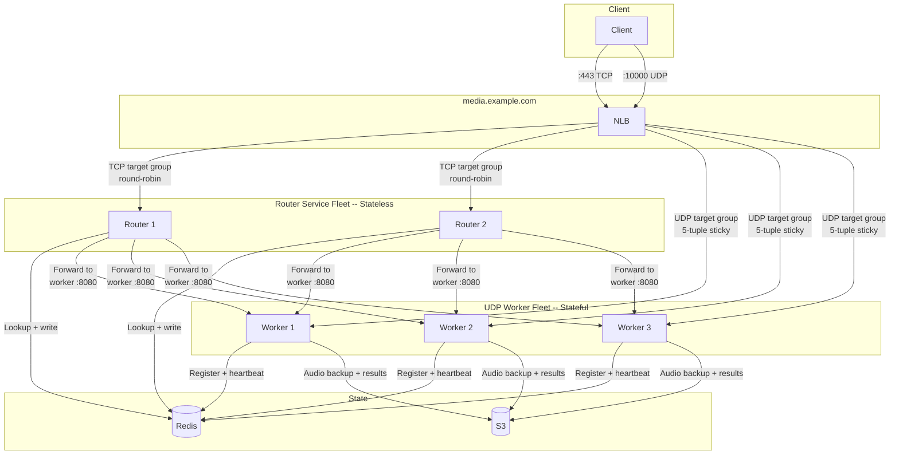
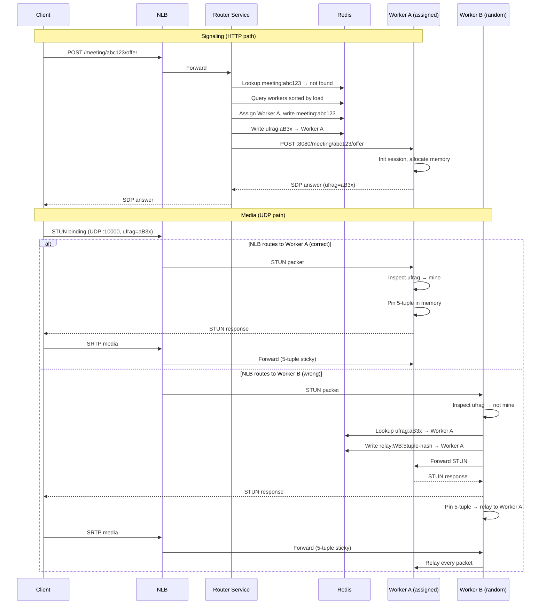
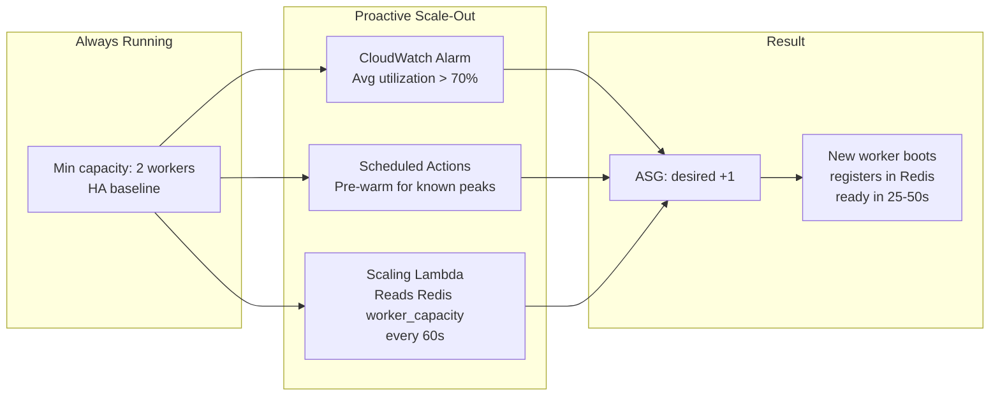
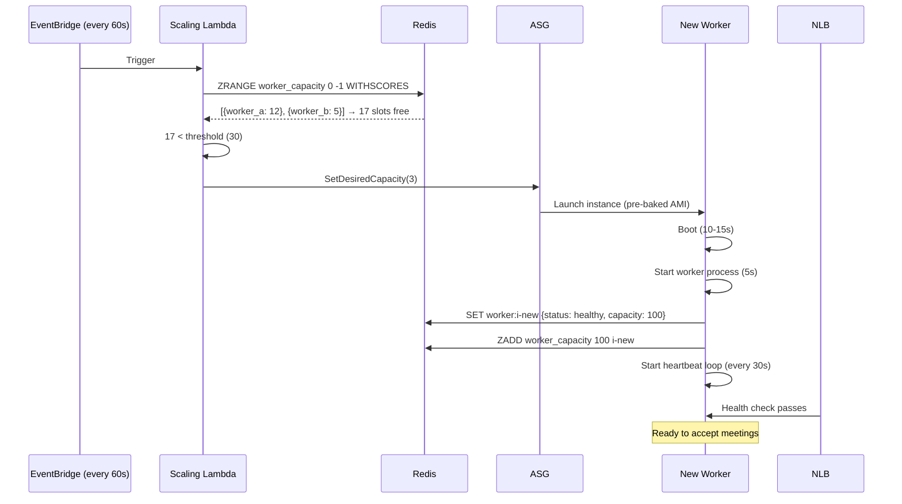
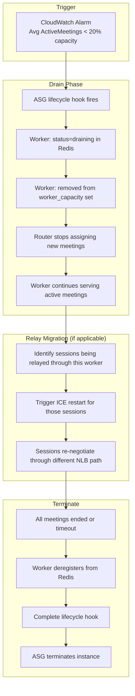

# WebRTC Sticky Routing Architecture

**Status:** Draft  
**Date:** 2025-02-04  

---

## 1. Problem

A meeting system sends meeting_ids to our system. Our system must:

- Accept HTTP requests (signaling, actions) per meeting_id
- Accept WebRTC UDP media per meeting_id
- Route both to the correct stateful worker that owns that meeting_id
- Expose a single DNS entrypoint to clients
- Scale workers up and down based on demand
- Handle the case where no worker is available yet

**Constraints:**
- Single DNS name (different ports for HTTP vs UDP acceptable)
- Client never knows which worker it talks to
- Worker holds state per meeting (audio buffers, session data)
- All traffic for a given meeting_id must reach the owning worker
- External meeting creation is unaware of worker internals

---

## 2. Architecture



---

## 3. Component Responsibilities

### 3.1 NLB

**Role:** Single entrypoint. Receives all external traffic. Routes by port and protocol.

| Listener | Port | Protocol | Target Group | Stickiness |
|----------|------|----------|--------------|------------|
| HTTP | :443 | TCP (TLS termination) | Router Service fleet | None |
| Media | :10000 | UDP | Worker fleet | 5-tuple automatic |

**Does not:**
- Inspect application data
- Know about meeting_ids
- Make routing decisions beyond port/protocol

### 3.2 Router Service

**Role:** Stateless HTTP proxy. Receives all HTTP, resolves meeting_id to worker, forwards.

**Responsibilities:**

| Responsibility | Detail |
|----------------|--------|
| Parse meeting_id | Extract from request path |
| Resolve worker | Look up `meeting:{id}` in Redis |
| Assign worker | If meeting is new, select least-loaded worker and write mapping |
| Check capacity | Before assigning, verify a worker has capacity. Capacity should always be available (proactive scaling ensures this). If unexpectedly none, return 503 with Retry-After header. |
| Forward request | Proxy HTTP to worker's internal endpoint |
| Return response | Pass worker response back to client |
| Health check | Expose `/health` for NLB |

**Does not:**
- Hold session state
- Process audio
- Handle UDP
- Maintain WebSocket connections

**Endpoints it proxies:**

| Endpoint | Purpose |
|----------|---------|
| `POST /meeting/{id}/offer` | SDP signaling |
| `POST /meeting/{id}/answer` | SDP answer |
| `POST /meeting/{id}/ice` | ICE candidates |
| `POST /meeting/{id}/action` | Application actions |
| `GET /meeting/{id}/status` | Meeting status |
| `DELETE /meeting/{id}` | End meeting |

### 3.3 UDP Worker

**Role:** Own meetings. Handle WebRTC media. Maintain per-meeting state. Expose internal HTTP for Router Service.

**Responsibilities:**

| Responsibility | Detail |
|----------------|--------|
| WebRTC termination | Handle STUN/DTLS/SRTP |
| STUN inspection | On first UDP packet, inspect ufrag to identify meeting |
| Own-or-relay decision | If meeting is mine, handle. If not, look up owner and relay. |
| Audio buffering | Store audio chunks in memory or disk |
| Transcription forwarding | Send audio to external STT API |
| Result streaming | Return transcription to client via data channel or HTTP |
| Session lifecycle | Init, active, finalizing, cleanup |
| Capacity reporting | Publish active_meetings count to Redis every 30s |
| Health check | Expose `:8080/health` for NLB and Router Service |
| Relay tracking | If relaying for another worker, track in Redis |

**Internal HTTP endpoints (`:8080`, private):**

| Endpoint | Purpose |
|----------|---------|
| `POST /meeting/{id}/offer` | Initialize session, return SDP answer |
| `POST /meeting/{id}/ice` | Add ICE candidate |
| `POST /meeting/{id}/action` | Execute action on session |
| `GET /meeting/{id}/status` | Return session state |
| `DELETE /meeting/{id}` | Finalize and cleanup |
| `GET /health` | Instance health |
| `GET /metrics` | Active meetings, memory, relay count |

**Does not:**
- Accept external HTTP directly (only via Router Service)
- Know about other meetings on other workers (except relay targets)

---

## 4. UDP Routing

### 4.1 STUN-Aware (Primary Approach)



### Relay Behavior

A worker that relays **does not lose capacity for its own meetings**. Relaying is lightweight packet forwarding:

| Aspect | Impact |
|--------|--------|
| CPU | Negligible (no decryption, just forward) |
| Memory | ~1KB per relay (5-tuple → target mapping) |
| Bandwidth | 1x inbound + 1x outbound per relayed session |
| Latency | +1-3ms per packet |

A worker can serve its own 100 meetings AND relay 50 sessions simultaneously. However, bandwidth is the constraint. Each audio session is roughly 50-100 kbps. 50 relayed sessions = ~5 Mbps extra. This is tracked and factored into capacity.

### Wrong-Worker Probability

| Workers in Fleet | Chance of Wrong Landing | Relayed Sessions (100 meetings) |
|------------------|-------------------------|---------------------------------|
| 2 | 50% | ~50 |
| 5 | 80% | ~80 |
| 10 | 90% | ~90 |
| 20 | 95% | ~95 |

At scale, most sessions are relayed. The +1-3ms overhead is acceptable for audio. If not, use port-per-meeting.

### 4.2 Port-Per-Meeting (Alternative)

Each meeting gets a unique UDP port. NLB routes by destination port to the correct worker deterministically.

| Aspect | Detail |
|--------|--------|
| Port range | 10000-60000 |
| Max concurrent meetings | ~50K per NLB IP |
| Wrong-worker probability | 0% (always correct) |
| Media latency overhead | 0ms |
| Complexity | Port allocation, NLB listener management |
| NLB listener limit | 50 default (request increase) |

**When to prefer:** Zero-latency requirement, concurrent meetings < 50K, team willing to manage port lifecycle.

### 4.3 Comparison

| Criteria | STUN-Aware | Port-Per-Meeting |
|----------|------------|------------------|
| Media latency (best case) | +0ms | +0ms |
| Media latency (worst case) | +1-3ms (relay) | +0ms |
| Concurrent meeting limit | Unlimited | ~50K |
| NLB config | 1 UDP listener | Dynamic port management |
| KV in media path | Redis (first packet only) | No |
| Custom code | STUN parser + relay | Port allocator |
| Operational complexity | Low | Medium |

---

## 5. KV Store Design

### 5.1 Store Choice

Redis (ElastiCache) is the sole KV store. It handles all routing, state, and coordination.

| Requirement | Redis |
|-------------|-------|
| Meeting → worker lookup | <1ms |
| STUN ufrag resolution | <1ms |
| Worker registry + capacity | <1ms |
| TTL / auto-expiry | Native |
| Sorted sets (least-loaded) | Native |
| HA | Cluster mode, multi-AZ |
| Cost | ~$15/month (cache.t4g.micro) |

Persistent records (completed meeting metadata, transcription results) are written to S3 as JSON. Redis is not used for long-term storage.

### 5.2 Redis Schema

**Meeting routing:**

```
meeting:{meeting_id}
{
    "worker_id": "i-abc123",
    "worker_ip": "10.0.1.50",
    "status": "active",
    "ice_ufrag": "aB3x",
    "created_at": "2025-02-04T10:00:00Z"
}
TTL: 24 hours (safety net)
```

**ICE ufrag mapping (STUN routing):**

```
ufrag:{ice_ufrag}
{
    "meeting_id": "abc123",
    "worker_ip": "10.0.1.50"
}
TTL: 5 minutes (only needed during ICE negotiation)
```

**Worker registry:**

```
worker:{worker_id}
{
    "instance_id": "i-abc123",
    "private_ip": "10.0.1.50",
    "active_meetings": 42,
    "relay_count": 3,
    "capacity": 100,
    "memory_used_mb": 3200,
    "disk_used_mb": 12800,
    "status": "healthy",
    "last_heartbeat": "2025-02-04T10:30:00Z"
}
TTL: 120 seconds (auto-expire if heartbeat stops)
```

**Relay tracking:**

```
relay:{relay_worker_id}:{5tuple_hash}
{
    "target_worker_ip": "10.0.1.50",
    "meeting_id": "abc123",
    "relayed_since": "2025-02-04T10:00:01Z"
}
TTL: matches meeting TTL
```

**Worker capacity sorted set (for least-loaded selection):**

```
ZADD worker_capacity {available_capacity} {worker_id}

Example:
  worker_capacity:
    "i-abc123" → 58  (58 slots free)
    "i-def456" → 12  (12 slots free)
    "i-ghi789" → 100 (empty worker)
```

Router selects worker with highest available capacity:
```
ZREVRANGE worker_capacity 0 0
```

**Meeting completion (written to S3, not kept in Redis):**

```
S3: s3://bucket/meetings/{meeting_id}/metadata.json
{
    "meeting_id": "abc123",
    "status": "completed",
    "created_at": "2025-02-04T10:00:00Z",
    "completed_at": "2025-02-04T11:30:00Z",
    "duration_seconds": 5400
}

S3: s3://bucket/meetings/{meeting_id}/transcription.json
{
    "meeting_id": "abc123",
    "chunks": [
        {"text": "...", "start": 0.0, "end": 2.5, "confidence": 0.97},
        ...
    ]
}
```

### 5.3 Who Reads/Writes What

| Component | Redis Reads | Redis Writes | S3 Writes |
|-----------|-------------|--------------|-----------|
| **Router** | meeting:{id}, worker_capacity | meeting:{id}, ufrag:{ufrag} | -- |
| **Worker** | ufrag:{ufrag} (STUN lookup) | worker:{id} (heartbeat), relay:{} | meeting metadata, transcription, audio backup |
| **Scaling Lambda** | worker_capacity (aggregate) | -- | -- |

---

## 6. Scaling

### 6.1 Principle: Never Cold Start

Cold starts are unacceptable. A worker must always be available when a meeting arrives. This is achieved through proactive scaling: we scale out **before** capacity is exhausted, never in reaction to a failed assignment.

**Two mechanisms ensure capacity is always available:**

**Mechanism 1: CloudWatch Alarm (reactive safety net)**

CloudWatch monitors aggregate capacity across the worker fleet. When average utilization crosses 70%, ASG adds a worker. This ensures a new instance is booting well before the fleet hits 100%.

**Mechanism 2: Scheduled Scaling / Predictive (proactive)**

For known traffic patterns (business hours, recurring meetings), scheduled ASG actions pre-warm capacity before demand arrives.



**Scaling Lambda (recommended primary trigger):**

A Lambda function runs every 60 seconds (EventBridge cron). It reads the `worker_capacity` sorted set from Redis, computes aggregate available capacity, and adjusts ASG desired count if needed.

```
Every 60s:
  1. Read ZRANGE worker_capacity 0 -1 WITHSCORES
  2. Sum available capacity across all healthy workers
  3. If total_available < threshold (e.g., 30% of total capacity):
       → SetDesiredCapacity(current + 1)
  4. If total_available > 80% of total capacity AND workers > min:
       → SetDesiredCapacity(current - 1)  (triggers drain)
```

This is more responsive than CloudWatch (which has 1-5 min alarm delay) and more accurate (reads actual capacity from Redis rather than CloudWatch metrics which lag).

| Strategy | Trigger | Response Time | Accuracy |
|----------|---------|---------------|----------|
| Scaling Lambda (60s cron) | Redis capacity < 30% | ~60s to detect + 25-50s boot | High (real-time Redis data) |
| CloudWatch Alarm | Metric > 70% avg | 1-5 min detect + 25-50s boot | Medium (metric lag) |
| Scheduled Actions | Cron (e.g., 8am weekdays) | Pre-positioned | Predictable patterns only |

**All three can coexist.** Scaling Lambda is the primary. CloudWatch is the safety net. Scheduled actions handle predictable peaks.

### 6.2 Scale-Out



**Timeline:**

| Step | Duration | Cumulative |
|------|----------|------------|
| ASG launches instance | 10-20s | 10-20s |
| Instance boots | 10-15s | 20-35s |
| User data / bootstrap | 5-15s | 25-50s |
| Worker registers in Redis | <1s | 25-51s |
| NLB health check passes | 10-30s (interval dependent) | 35-81s |
| **Total** | | **35-81s** |

**Optimization:** Pre-bake AMI with all dependencies. Reduces bootstrap to ~5s. Total: 25-50s.

### 6.3 Scale-In



**Draining rules:**

| Rule | Value |
|------|-------|
| New meetings | Rejected (Router skips draining workers) |
| Active meetings | Continue until completion |
| Drain timeout | Configurable (default: 1 hour) |
| Timeout action | Force terminate, client reconnects |
| Relay sessions | ICE restart to migrate, or wait for meeting end |

### 6.4 Scaling Configuration

| Parameter | Value | Rationale |
|-----------|-------|-----------|
| Min instances | 2 | Always warm, HA across AZs |
| Max instances | No limit | Autoscale to demand |
| Scaling Lambda interval | 60s | Near real-time capacity tracking |
| Scale-out threshold | Available capacity < 30% | New instance ready before full |
| Scale-in threshold | Available capacity > 80% | Avoid over-provisioning |
| CloudWatch alarm (safety net) | Avg utilization > 85% | Catches if Lambda fails |
| Scale-out cooldown | 60s | Allow new instance to register |
| Scale-in cooldown | 300s | Avoid thrashing |
| Drain timeout | 3600s | Max meeting duration tolerance |
| AMI | Pre-baked with all dependencies | Boot to ready in 25-50s |

---

## 7. Worker Capacity

### 7.1 Capacity Per Instance

Depends on workload and storage choice:

| Workload | t3.large (8GB, 2 vCPU) | r6i.large (16GB, 2 vCPU) | c6i.xlarge (8GB, 4 vCPU) |
|----------|------------------------|--------------------------|--------------------------|
| Audio buffer in memory (128MB/session) | ~50 meetings | ~110 meetings | ~50 meetings |
| Audio buffer on disk (EBS) | ~200 meetings | ~200 meetings | ~300 meetings |
| Audio passthrough (no buffer) | ~500 meetings | ~500 meetings | ~800 meetings |

### 7.2 Memory vs Disk vs S3 for Audio State

| Aspect | Memory (RAM) | Disk (EBS gp3) | Disk (Instance Store NVMe) | S3 |
|--------|-------------|-----------------|---------------------------|-----|
| Read/write latency | ~0.001ms | ~0.5-1ms | ~0.1ms | ~5-20ms |
| Capacity per session | 128MB (from RAM) | 128MB (from disk, ~unlimited) | 128MB (from local SSD) | Unlimited |
| Sessions per instance | Limited by RAM | Limited by CPU/network | Limited by CPU/network | Limited by CPU/network |
| Data on instance termination | Lost | EBS persists (if not deleted) | Lost | Persists |
| Cost | Instance price | +$0.08/GB/month (gp3) | Included in instance price | ~$0.023/GB/month + requests |
| IOPS | N/A | 3000 baseline (gp3) | 100K+ | N/A (request-based) |
| Durability | None | 99.999% | None | 99.999999999% (11 nines) |
| Good for | Low-latency hot buffer | Overflow buffer, warm state | High-throughput buffer | Archival, backup, cold state |

**Recommended pattern:** Hybrid approach.

```
Audio arrives → Memory buffer (last N seconds, hot)
                  ↓ flush every 5-10s
               Disk (EBS/NVMe) or S3 (accumulated chunks)
                  ↓ on meeting end
               S3 (final archive + transcription results)
```

- **Memory:** Active audio ring buffer (last 5-30 seconds). Fastest access for real-time STT streaming.
- **Disk (EBS/NVMe):** Accumulated audio chunks during session. Used if memory is constrained or sessions are long.
- **S3:** Final destination. On meeting completion, worker writes audio archive + transcription JSON to S3. Also used for periodic checkpoints during long meetings (crash recovery).

**For audio buffering before STT:** Disk latency of 0.5-1ms is acceptable. Audio chunks arrive every 20-60ms. Disk is not the bottleneck. S3 latency (5-20ms) is acceptable for periodic flushes but too slow for real-time buffer reads.

### 7.3 Compute Options

| Option | Cold Start | Isolation | Scaling | Disk Options | Recommendation |
|--------|-----------|-----------|---------|--------------|----------------|
| **EC2 + ASG** | ~0 (pre-warmed) | Process | ASG custom metric | EBS, instance store | POC + Production |
| **ECS on EC2** | ~0 (pre-warmed) | Container | ECS service scaling | EBS via task volumes | Production |
| **EKS** | ~0 (pre-warmed) | Pod | HPA, KEDA | EBS CSI, emptyDir | Large scale |
| **ECS Fargate** | 30-60s | Container | Service | 20GB ephemeral only | Not viable |

**EC2 + ASG:** Simplest. Direct control over instance type, storage, networking. Best for POC and small-medium production.

**ECS on EC2:** Container isolation. Easier deployments (docker push). Task-level resource limits. Better for larger production with multiple services.

**EKS:** Full Kubernetes. HPA with custom metrics. KEDA for event-driven scaling. Most complex. Only justified at large scale (50+ nodes) or if team already uses K8s.

---

## 8. Latency Budget

### HTTP Path

| Hop | Latency |
|-----|---------|
| Client → NLB | Network RTT |
| NLB → Router | <1ms |
| Router → Redis | <1ms |
| Router → Worker :8080 | 1-3ms |
| Worker processing | Application-dependent |
| **Total overhead** | **3-6ms** |

### UDP Path (STUN-Aware)

| Hop | Latency | When |
|-----|---------|------|
| Client → NLB | Network RTT | Every packet |
| NLB → Worker | <1ms | Every packet |
| STUN ufrag → Redis | <1ms | First packet only |
| 5-tuple pin | <0.1ms | First packet only |
| Relay hop (if wrong worker) | +1-3ms | Every packet (if relayed) |
| **Steady state (correct)** | **<1ms** | |
| **Steady state (relayed)** | **2-4ms** | |

### UDP Path (Port-Per-Meeting)

| Hop | Latency | When |
|-----|---------|------|
| Client → NLB | Network RTT | Every packet |
| NLB → Worker | <1ms | Every packet |
| **Steady state** | **<1ms** | Always |

---

## 9. TURN (Optional)

TURN solves client-side NAT/firewall issues. It is **not part of the routing architecture**.

| When Needed | Why |
|-------------|-----|
| Client behind symmetric NAT | Cannot establish direct UDP |
| Corporate firewall blocks UDP | Need TCP fallback |
| Mobile carrier-grade NAT | Unstable UDP paths |

If deployed, TURN relays client media to the NLB. Our routing architecture works the same -- NLB receives UDP regardless of whether it came directly or via TURN.

**Options:** Self-hosted coturn on EC2, or managed (Twilio Network Traversal, Xirsys).

---

## 10. Observability

| Metric | Source | Purpose |
|--------|--------|---------|
| ActiveMeetings per worker | Worker → CloudWatch | Scaling trigger |
| RelayCount per worker | Worker → CloudWatch | Monitor wrong-worker rate |
| RelayBandwidth per worker | Worker → CloudWatch | Capacity planning |
| MemoryUsed per worker | Worker → CloudWatch | Capacity safety |
| DiskUsed per worker | Worker → CloudWatch | If using disk storage |
| HTTP Latency (p50, p99) | Router → CloudWatch | Performance |
| MeetingAssignmentLatency | Router → CloudWatch | Time to assign worker |
| STUNResolutionLatency | Worker → CloudWatch | First-packet handling |
| NLB HealthyHostCount | NLB → CloudWatch | Fleet health |
| NLB ProcessedBytes | NLB → CloudWatch | Bandwidth |

**CloudWatch** for native AWS metrics. **Grafana** optional for unified dashboards (export via CloudWatch Metric Streams or direct from application to Prometheus).

---

## 11. Security

| Rule | Detail |
|------|--------|
| NLB → Router | TCP :443, NLB source only |
| NLB → Workers | UDP :10000, NLB source only |
| Router → Workers | TCP :8080, Router SG only |
| Workers → Redis | TCP :6379, Worker SG only |
| Workers → S3 | Via VPC endpoint |
| Workers → Internet | Via NAT Gateway (external STT API) |

---

## 12. Component Summary

| Component | AWS Service | Stateful | Fleet | Scales By |
|-----------|-------------|----------|-------|-----------|
| DNS | Route53 | No | N/A | N/A |
| Entrypoint | NLB (2 listeners) | No | N/A | Automatic |
| Router Service | EC2 in ASG (or ECS) | No | Separate | CPU / request count |
| UDP Workers | EC2 in ASG (or ECS on EC2) | Yes | Separate | Active meetings |
| KV Store | ElastiCache Redis | No | Managed | Automatic |
| Scaling Lambda | Lambda + EventBridge | No | N/A | N/A (runs every 60s) |
| Audio/Results | S3 | No | N/A | N/A |
| Monitoring | CloudWatch | No | N/A | N/A |

---

## 13. References

- [NLB Listeners and Target Groups](https://docs.aws.amazon.com/elasticloadbalancing/latest/network/load-balancer-target-groups.html)
- [NLB TLS Termination](https://docs.aws.amazon.com/elasticloadbalancing/latest/network/create-tls-listener.html)
- [ASG Lifecycle Hooks](https://docs.aws.amazon.com/autoscaling/ec2/userguide/lifecycle-hooks.html)
- [ASG Custom Metrics Scaling](https://docs.aws.amazon.com/autoscaling/ec2/userguide/as-using-sqs-queue.html)
- [ElastiCache Redis](https://docs.aws.amazon.com/AmazonElastiCache/latest/red-ug/WhatIs.html)
- [S3 Object Storage](https://docs.aws.amazon.com/AmazonS3/latest/userguide/Welcome.html)
- [EBS gp3 Performance](https://docs.aws.amazon.com/ebs/latest/userguide/general-purpose.html)
- [STUN Protocol RFC 5389](https://tools.ietf.org/html/rfc5389)
- [ICE RFC 8445](https://tools.ietf.org/html/rfc8445)
- [VPC Endpoints](https://docs.aws.amazon.com/vpc/latest/privatelink/vpc-endpoints-s3.html)